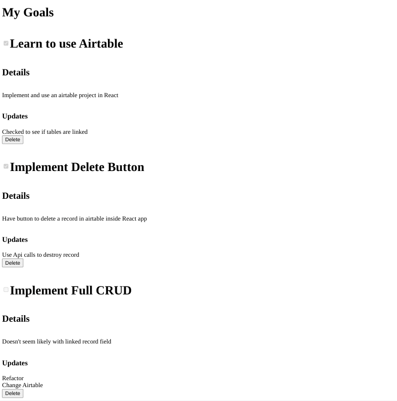

<h1 align="center">React Goal Manager</h1>

   Solution to a challenge from <a href="https://50reactprojects.com/" target="_blank">50 react projects for the static web</a>.

## Table of Contents

- [Overview](#overview)
  - [Built With](#built-with)
  - [Thoughts](#thoughts)
- [Requirements](#requirements)
- [Improvements](#improvements)
- [Useful Resources](#useful-resources)

## Overview

### Built With

- Airtable
- React
- To run, git clone and add an airtable api key.  

### Thoughts

Linked records are not worth it. Managing linked records causes code duplication and extra api requests.  
You can't update them inside an embedded form.  Deleting a record with a linked field does not delete the linked record in its table.  Thus you will have orphaned data cluttering your table.  The orphaned data can break your app.  You have to delete it at the same time you delete the main record.

You can embed an iframe and create record but you cannot create a linked record with custom data at the same time.

Have to look up about Airtable case sensitivity.

## Requirements

- [x] Create a list of goals and put them on your website.
- [x] Add your goals to Airtable and use the API to dynamically request your list of goals.
- [x] Add a field to Airtable that tracks progress of each goal and show that progress status on your website.

## Improvements

- styling / accessibility
- make full crud 
- can add a form from airtable inside an iframe (using env variable in iframe causes problems with cross origin)

### Resources

- [Stack Overflow](https://stackoverflow.com/questions/42182577/is-it-possible-to-use-dotenv-in-a-react-project) - React & dotenv
- [CRA](https://create-react-app.dev/docs/adding-custom-environment-variables/) - docs from create-react-app on env variables
- [CD DATA](https://www.cdata.com/kb/tech/airtable-connect-react.rst) - react & airtable
- [Crowdbotics](https://www.crowdbotics.com/blog/use-airtable-cloud-based-database-for-react-app) - react & airtable
- [YouTube](https://www.youtube.com/watch?v=PJz1QlpRJeQ) - Airtable CRUD
- [Medium](https://medium.com/technofunnel/react-uncontrolled-elements-with-useref-hooks-9c5873476c6f) - useRef and forms
- [YouTube](https://www.youtube.com/watch?v=0gRq39R_qsQ) - Airtable forms
- [Stack Overflow](https://stackoverflow.com/questions/36833192/get-the-value-of-checkbox-using-ref-in-react) - checkbox and useRef
- [Airtable Forums](https://community.airtable.com/t/how-can-i-delete-rows-in-linked-tables/31278) - on delete, linked records are orphaned.
- [Stack Overflow](https://stackoverflow.com/questions/49339340/conditional-rendering-if-a-prop-contains-a-blank-array) - conditional rendering
- [Stack Overflow](https://stackoverflow.com/questions/51897178/react-handle-empty-props/51897454) - react empty props
- [Blog](https://blog.bitsrc.io/best-practices-in-using-iframes-with-react-6193feaa1e08) - iframes in react
- [Airtable Forums](https://community.airtable.com/t/using-forms-to-link-records/28934/3) - Airtable Form to link records